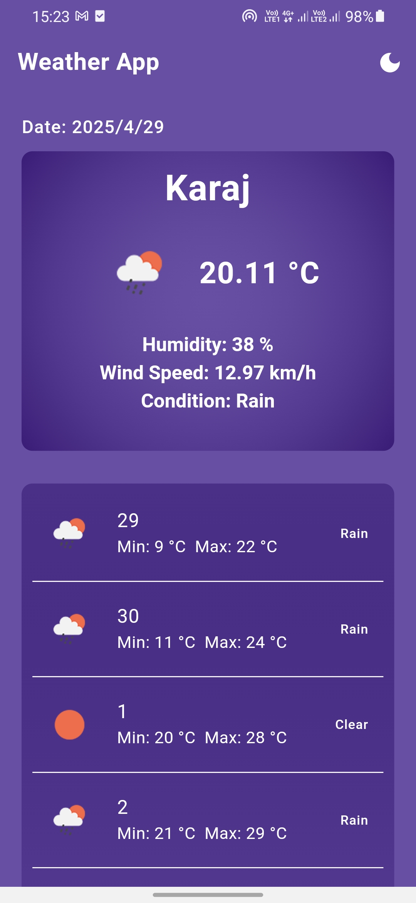
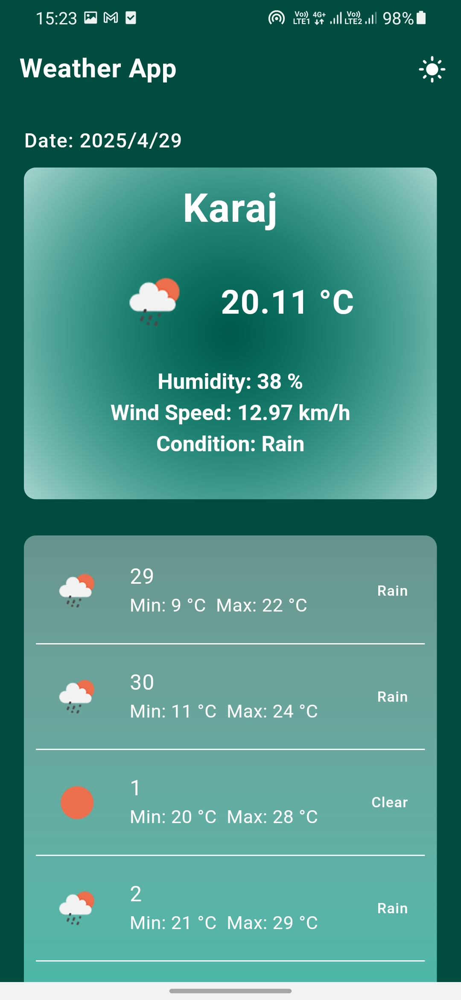

# 🌦️ Flutter Weather App

A modern weather app built with Flutter that automatically fetches the user's current location using GPS and displays live weather data from an external API.

---

## 📱 Features

- 🌍 **Automatic Location Detection** using `geolocator`
- ☀️ **Real-Time Weather Data** via HTTP APIs
- 🎨 **Dark and Light Themes** support
- 🔄 **Portrait and Landscape Modes** fully supported
- ⚙️ **Error Handling** with user-friendly messages
- 📦 **State Management** using `Provider`

---

## 🛠️ Tech Stack

- **Flutter** (latest stable)
- `geolocator` – For GPS/location services
- `http` – For REST API calls
- `provider` – For reactive state management
- Responsive UI with both `portrait` and `landscape` orientation
- Support for both `light` and `dark` themes

---

## 📷 Screenshots

| Light Theme | Dark Theme |
|-------------|------------|
|  |  |

---

## ✨ Getting Started

### 1. Clone the Repo

```bash
git clone https://github.com/your-username/flutter-weather-app.git
cd flutter-weather-app
```

### 2. Install Dependencies

```bash
flutter pub get
```

### 3. Run the App

```bash
flutter run
```

Make sure your emulator or real device has location services enabled.

---

## ⚠️ Permissions Required

- Location permission (`while in use` or `always`)
- GPS must be enabled manually if not available

---

## 👤 Developer

**Amirhossein Jahangiri**  
🌐 [iamjahangiri.ir](https://www.iamjahangiri.ir)

If you find this project helpful, please ⭐ the repository and share it!

---

## 📄 License

This project is licensed under the MIT License.

